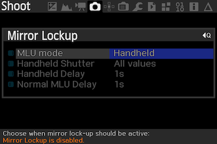

# eclipse_OZ.lua
## Eclipse Magic Lantern  

Exécution d'un cycle de photos pour suivre une éclipse totale de Soleil.  
Inspiré du script eclipse_magic de Brian Greenberg.  
grnbrg@grnbrg.org http://www.grnbrg.org/

Préparation pour l'éclipse du 14 décembre 2020 au Chili ou Argentine.  
Qualifié avec un Canon 6D.  

## Principe de fonctionnement
Le programme eclipse_OZ.lua va réaliser une série de photos à des heures précises en fonction des commandes passées dans un fichier de séquence.  
Les heures peuvent être indiquées en fonction de circonstances locales, 1er contact, 2éme contact...  
Elles peuvent être indiquées aussi en absolue, 13h45m06s...  
Le programme ne gère pas le jour, la séquence commencera à l'heure indiquée quel que soit le jour.
Il est exécuté par l'application Magic Lantern. Les informations sur Magic Lantern sont données dans le chapitre suivant.

## Magic Lantern
Installer Magic Lantern sur votre boitier.  
https://www.magiclantern.fm/index.html  
Attention ! Il faut activer le module lua  "Lua scripting" dans le menu Modules de MagicLantern.  
  
Copier le script eclipse_OZ.lua dans le répertoire ML/SCRIPTS de la carte SD ainsi que le descriptif de la séquence, SOLARECL.TXT.

## Descriptif de la séquence
La séquence de photos est décrite dans un fichier texte SOLARECL.TXT.  
Chaque séquence est décrite sur une ligne composée de paramètres séparés par une virgule "," ou un double point ":".
Il faut respecter les règles suivantes
* Pas de ligne vide
* Pas de paramètre vide, y mettre un "-"
* \# pour commenter une ligne
* Les séquences doivent se suivre temporellement. Le fichier n'est lu que dans un sens. 

Cinq types de lignes sont possibles, Verif, Config, Boucle, Photo, Interval.

## Syntaxe de la ligne Verif
Quatre paramètres du boitier sont analysés au démarrage du programme et affichés si une ligne Verif est présente dans le descriptif.  
Il est possible de les rendre bloquants si une valeur est indiquée dans la ligne Verif.  
Si la valeur est - le paramètre n'est pas vérifié. Si la valeur est indiquée la vérification est faite.
Les paramètres ne sont vérifiés qu'au début du cycle.

### Description des champs
Position|Nom|Valeur|Description
:---:|:---:|:---:|:---
1|Action|Verif|Ligne d'activation de la vérification
2|Mode|- ou 3|Le mode manuel est obligatoire sa valeur est 3 (*)
3|Autofocus|- ou 0|L'autofocus doit être désactivé = 0
4|Batterie|- ou N|Indiquer le niveau minimum de batterie en %
5|Stockage|- ou N|Indiquer l'espace minimum en méga octets

(*) https://builds.magiclantern.fm/lua_api/modules/constants.html#MODE

### Exemple
Verif : Mode M, AF Off, 20%, 4000M°  
`Verif,3,0,20,4000`

## Syntaxe de la ligne Config
La ligne Config permet de travailler en mode heure relative.
En spécifiant les circonstances locales il n'est pas nécessaire de modifier l'ensemble du fichier quand celles-ci changent.
La ligne décrit la config de la manière suivante :
```
       C1    C2    Max   C3    C4
Config,H:M:S,H:M:S,H:M:S,H:M:S,H:M:S,TestMode
```
### Description des champs
Position|Nom|Valeur|Description
:---:|:---:|:---:|:---
1|Action|Config|Ligne de définition des circonstances locales de l'éclipse
2|Hd|0-23|Heure du premier contact C1
3|Md|0-59|Minute du premier contact 
4|Sd|0-59|Seconde du premier contact
5|Hd|0-23|Heure du deuxième contact C2
6|Md|0-59|Minute du deuxième contact
7|Sd|0-59|Seconde du deuxième contact
8|Hd|0-23|Heure du maximum Max
9|Md|0-59|Minute du maximum
10|Sd|0-59|Seconde du maximum
11|Hd|0-23|Heure du troisième contact C3
12|Md|0-59|Minute du troisième contact
13|Sd|0-59|Seconde du troisième contact
14|Hd|0-23|Heure du quatrième contact C4
15|Md|0-59|Minute du quatrième contact
16|Sd|0-59|Seconde du quatrième contact
17|TestMode|0 ou 1|Active/Désactive le mode de test

#### Exemple
Config : C1 = 14h41m05s C2 = 16h02m49s Max = 16h03m53s C3 = 16h04m58s C4 = 17h31m03s TestMode = actif
`Config,14:41:05,16:02:49,16:03:53,16:04:58,17:31:03,1`

## Syntaxe des lignes Photo, Boucle et Interval
L'action Photo réalise une photo à l'heure voulue et avec les paramètres indiqués dans la ligne.

L'action Boucle réalise une série de photos entre l'heure de début et l'heure de fin avec un intervalle donné.

L'action Interval est identique à Boucle mais on indique le nombre de photos au lieu de l'intervalle. L'intervalle entre deux photos est calculé par la durée divisée par le nombre de photos. A cause des arrondis il est possible que le nombre de photos réalisées soit légèrement différent de celui voulu.

Les heures peuvent être indiquées en mode absolu ou relatif.

### Syntaxe en heure absolue
En heure absolue, l'image ou la séquence sera réalisée à l'heure indiqué littéralement.
Chaque ligne décrit une séquence de la manière suivante :

`Action,-,-,Hd:Md:Sd,-,Hf:Mf:Sf,Interval,Aperture,ISO,ShutterSpeed,MLUDelay`

### Syntaxe en heure relative
En heure relative, l'image ou la séquence sera réalisée en fonction de la circonstance locale, de l'opérande et de l'heure indiquée.
Chaque ligne décrit une séquence de la manière suivante :

`Action,C1,+,Hd:Md:Sd,+,Hf:Mf:Sf,Interval,Aperture,ISO,ShutterSpeed,MLUDelay`

### Description des champs
Position|Nom|Valeur|Description
:---:|:---:|:---:|:---
1|Action|Boucle, Interval ou Photo|Suite de photos identiques ou photo unique
2|Ref|C1,C2,Max,C3,C4 ou -|Indique le point de référence, mettre un "-" si en mode absolu
3|Oper|+ ou -|Ajoute ou soustrait l'heure de début à la Ref
4|Hd|0-23|Heure de début de la séquence
5|Md|0-59|Minute de début de la séquence
6|Sd|0-59|Seconde de début de la séquence
7|Oper|+ ou -|Ajoute ou soustrait l'heure de fin à la Ref
8|Hf|0-23|Heure de fin de la séquence (*)
9|Mf|0-59|Minute de fin de la séquence (*)
10|Sf|0-59|Seconde de fin de la séquence (*)
11|Interval ou Number|Num. >= 1|Intervalle entre deux photos en seconde (*) ou nombre de photo à faire entre Hd et Hf
12|Aperture|Diaph.|Valeur du Diaphragme (2.8,8,11...)(**)
13|ISO|Num.|Sensibilité du capteur (100, 800, 6400,...)(**)
14|ShutterSpeed|Num.|Vitesse d'exposition en seconde (**)
15|MLUDelay|Num.|Délais d'attente entre la montée du mirroir et le déclenchement, en miliseconde. Si 0 pas de montée du mirroir avant le déclenchement. 

(*) Uniquement utilisé par l'action "Boucle" et "Interval".  
(**) Attention prendre des valeurs compatibles avec votre équipement.

#### Exemples

Mode absolu, série de 21:22:05 à 21:25:35, une photo toutes les 5s, Diaph=8, ISO=200, Vitesse 1/2000, pas de Mirror lockup.  
>`Boucle,-,-,21:22:05,-,21:25:35,5,8,200,0.0005,0`

Mode relatif, série de 00:20:00 avant C2 à 00:01:30 après C2, une photo toutes les 5s, Diaph=8, ISO=200, Vitesse 1/2000, pas de Mirror lockup.  
>`Boucle,C2,-,00:20:00,+,00:01:30,5,8,200,0.0005,0`

Mode relatif, série de 200 photos entre 00:20:00 avant C2 et 00:01:30 après C2, Diaph=8, ISO=200, Vitesse 1/2000, pas de Mirror lockup.  
>`Interval,C2,-,00:20:00,+,00:01:30,200,8,200,0.0005,0`

Ligne de commentaire.  
>`# Commentaire`  

Mode absolu, photo à 21:22:40, Diaph=4, ISO=1600, Vitesse 1, Mirror lockup avec 0,5s de délais.
>`Photo,-,-,21:22:40,-,-,-,-,-,4,1600,1,500`

Mode relatif photo 01:10:30 avant C1, Diaph=4, ISO=1600, Vitesse 1, Mirror lockup avec 0,5s de délais.
>`Photo,C1,-,01:10:30,-,-,-,-,-,4,1600,1,500`

### Attention !
Le passage du changement de jour n'est pas fonctionnel dans cette version.  
Utiliser l'heure locale, il y a rarement des éclipses à 0h TL.  
Le temps minimum entre deux images est de 1s.

## Lancement de la séquence
* Choisir le menu script.  
* Déplacer la barre de sélection sur le choix Eclipse ML OZ.  
* Lancer la séquence avec la touche SET.

Menu Scripts  


# Paramétrage du boitier
Le boitier doit être en mode :
* Auto power off à  Disable
* Mode Manuel
* Auto Focus en off

## Mirror Lockup
Si le boitier le permet il est possible d'utiliser le Mirrorlockup. Cela permet d'éviter des vibrations pendant la prise de vue.  
Menu Shoot - Mirror Lockup  
  
La configuration MLU Mirror Lockup est piloté par le script mais il est possible qu'elle ne soit pas acceptée. 

# Configurations
## Mode test
Pour tester le script il est possible d'utiliser le mode Test. Ce mode déroule le script normalement mais ne déclenche pas les photos.  
Pour activer/désactiver ce mode, modifier le champ TestMode dans la ligne Config.
* 0 => mode réel  
* 1 => mode test

# Fichier log
A chaque lancement de séquence, un fichier log __ECLIPSE.LOG__ est créé à la racine de la carte SD.  
Toutes les actions de la séquence sont loggés dans le fichier.
```
===============================================================================
ML/SCRIPTS/ECLIPS~1.LUA - 2020-3-5 23:28:19
===============================================================================

==> eclipse_OZ.lua - Version : 2.0
23:28:19 - Log begin.
23:28:19 - Script ML/SCRIPTS/SOLARECL.TXT loading.
23:28:19 - Table of 9 lines and 15 columns loaded.
23:28:19 - Action: Config C1: 14:41:05/52865s C2: 16:02:49/57769s Max: 16:03:53/57833s C3: 16:04:58/57898s C4: 17:31:03/63063s TestMode: 1
23:28:19 - Set test mode : 1
23:28:19 - Line 1 finish go to the next line.
23:28:19 - Conversion : C1 soit 52865 - 120 = 52745 soit 14:39:05
23:28:19 - Conversion : C1 soit 52865 + 30 = 52895 soit 14:41:35
23:28:19 - Action: Boucle TimeRef: C1 OperStart: - TimeStart: 00:02:00-52745s OperEnd: + TimeEnd: 00:00:30-52895s Interval: 20s Aperture 8 ISO 800 ShutterSpeed: 0.0005s MluDelay: 500s
23:28:19 - Set mirror lockup ON. Delay = 500
```