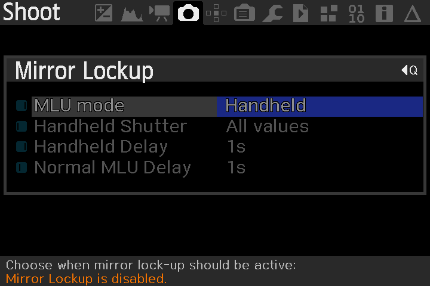

# eclipse_OZ
## Eclipse Magic Lantern  

Exécution d'un cycle de photos pour suivre une éclipse.  
Inspiré du script eclipse_magic de Brian Greenberg.  
grnbrg@grnbrg.org http://www.grnbrg.org/

Préparation pour l'éclipse du 14 décembre 2020 au Chili ou Argentine.  
Qualifié avec un Canon 6D.  
Attention ! Il faut activer le module lua  "Lua scripting" dans le menu Modules de MagicLantern et copier ce script dans le répertoire M/SCRIPTS de la carte SD

Le boitier doit être en mode manuel, AF off.  

Installer Magic Lantern sur votre boitier.
https://www.magiclantern.fm/index.html

# Paramétrage du boitier
## Mirror Lockup
Menu Shoot - Mirror Lockup

