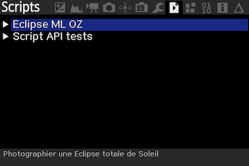

# eclipse_OZ
## Eclipse Magic Lantern  

Exécution d'un cycle de photos pour suivre une éclipse totale de Soleil.  
Inspiré du script eclipse_magic de Brian Greenberg.  
grnbrg@grnbrg.org http://www.grnbrg.org/

Préparation pour l'éclipse du 14 décembre 2020 au Chili ou Argentine.  
Qualifié avec un Canon 6D.  
## Magic Lantern

Installer Magic Lantern sur votre boitier.  
https://www.magiclantern.fm/index.html  
Attention ! Il faut activer le module lua  "Lua scripting" dans le menu Modules de MagicLantern.  

Copier le script eclipse_OZ.lua dans le répertoire ML/SCRIPTS de la carte SD ainsi que le descriptif de la séquence, SOLARECL.TXT.
### Lancement de la séquence
* Choisir le menu script.  
* Déplacer la barre de sélection sur le choix Eclipse ML OZ.  
* Lancer la séquence avec la touche SET.  

# Paramétrage du boitier
Le boitier doit être en mode :
* Auto power off à  Disable
* Mode Manuel
* Auto Focus en off

## Mirror Lockup
Menu Shoot - Mirror Lockup

Le MLU Mirror Lockup est piloté par le script mais il est possible que la configuration ne soit pas acceptée. 
