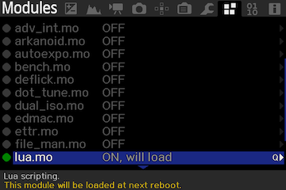

# Projet eclipse_OZ
## Eclipse Magic Lantern  

Exécution d'un cycle de photos pour suivre une éclipse totale de Soleil.  
Inspiré du script eclipse_magic de Brian Greenberg.  
grnbrg@grnbrg.org http://www.grnbrg.org/

Préparation pour l'éclipse du 14 décembre 2020 au Chili ou Argentine.  
Qualifié avec un Canon 6D.  

## Principe de fonctionnement
Le programme eclipse_OZ.lua va réaliser une série de photos à des heures précises en fonction des commandes passées dans un fichier de séquence.  
Les heures peuvent être indiquées en fonction de circonstances locales, 1er contact, 2éme contact...  
Elles peuvent être indiquées aussi en absolue, 13h45m06s...  
Le programme ne gère pas le jour, la séquence commencera à l'heure indiquée quel que soit le jour.
Il est exécuté par l'application Magic Lantern. Les informations sur Magic Lantern sont données dans le chapitre suivant.

## Magic Lantern
Installer Magic Lantern sur votre boitier.  
https://www.magiclantern.fm/index.html  
Attention ! Il faut activer le module lua  "Lua scripting" dans le menu Modules de MagicLantern.  
  
Copier le script eclipse_OZ.lua dans le répertoire ML/SCRIPTS de la carte SD ainsi que le descriptif de la séquence, SOLARECL.TXT.

## Script eclipse_OZ.lua
Script en langage Lua qui exécute les séquences décrites dans le fichier SOLARECL.TXT.
Il est exécuté par l'interpréteur Lua présent dans MagiLantern.

## SOLARECL.TXT
Ce fichier contient les séquences qui seront exécutées par eclipse_OZ.lua.
Il s'agit d'un template à modifier en fonction de la séquence que vous voulez réaliser.

## Manuel d'utilisation.md
Documentation d'utilisation du programme eclipse_OZ.

## MLua_PIC.sh
Script bash utilisé avec l'émulation ML Qemu.  
https://bitbucket.org/hudson/magic-lantern/src/qemu/contrib/qemu/README.rst  
Copie du script Lua en paramètre sur les pseudo SD Qemu et lancement du virtualiseur.

## MLua_mount_imgSD.sh
Script de montage des images des pseudos cartes SD pour Qemu et de copie du fichier en paramètre.

## MLua_Test.sh
Script bash utilise pour tester l'application.
Copie du script Lua en paramètre sur la carte SD présente dans le lecteur et démontage de celle-ci.
