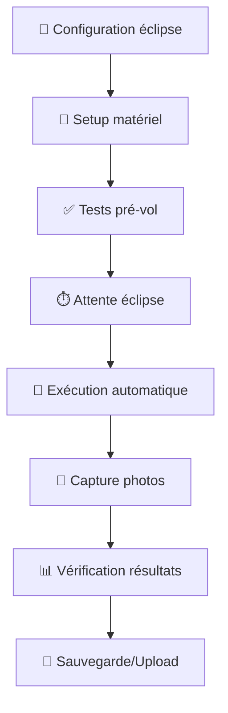

# Guide de Fonctionnement - Eclipse Photography Controller Python

## Table des matières

1. [Démarrage rapide](#démarrage-rapide)
2. [Installation et configuration](#installation-et-configuration)
3. [Utilisation quotidienne](#utilisation-quotidienne)
4. [Préparation d'éclipse](#préparation-déclipse)
5. [Configuration du matériel](#configuration-du-matériel)
6. [Fichiers de configuration](#fichiers-de-configuration)
7. [Exécution et monitoring](#exécution-et-monitoring)
8. [Résolution de problèmes](#résolution-de-problèmes)
9. [Maintenance et mise à jour](#maintenance-et-mise-à-jour)

## Démarrage rapide

### Installation express (Raspberry Pi)

```bash
# 1. Mise à jour système
sudo apt update && sudo apt upgrade -y

# 2. Installation dépendances
sudo apt install -y python3-pip gphoto2 libgphoto2-dev git

# 3. Récupération du projet
git clone https://github.com/eclipse-oz/eclipse_OZ.git
cd eclipse_OZ/python

# 4. Installation Python
pip3 install -r requirements.txt

# 5. Test rapide
python main.py --help
```

### Premier test

```bash
# Test avec configuration d'exemple
python main.py config_eclipse.txt --test-mode --log-level DEBUG

# Attendu:
# ✅ Configuration loaded successfully
# ✅ Camera detection: 2 cameras found
# ✅ Eclipse timings validated
# ℹ️  TEST MODE: No actual photos will be taken
# 📸 Simulation completed successfully
```

## Installation et configuration

### Prérequis matériels

- **Raspberry Pi 4** (recommandé) ou tout système Linux x86_64
- **Carte SD** ≥32GB (classe 10 minimum)
- **Alimentation stable** (UPS recommandé pour éclipses longues)
- **Appareils photo** compatibles GPhoto2 (voir liste)
- **Câbles USB** de qualité (éviter rallonges >3m)

### Compatibilité appareils photo

```bash
# Vérifier compatibilité de votre appareil
gphoto2 --list-cameras | grep -i "votre_modele"

# Appareils testés avec succès:
# - Canon EOS series (5D, 6D, 80D, 90D, R5, R6)
# - Nikon D-series (D750, D850, Z6, Z7)  
# - Sony Alpha series (A7 III, A7R IV)
# - Fujifilm X-T series
```

### Configuration réseau (optionnel)

```bash
# Configuration WiFi pour monitoring à distance
sudo nano /etc/wpa_supplicant/wpa_supplicant.conf

# Ajout réseau:
network={
    ssid="eclipse_monitoring"
    psk="votre_mot_de_passe"
}

# SSH pour accès distant
sudo systemctl enable ssh
sudo systemctl start ssh
```

## Utilisation quotidienne

### Workflow type



### Commandes essentielles

```bash
# Exécution standard
python main.py config_eclipse.txt

# Mode simulation (recommandé pour tests)
python main.py config_eclipse.txt --test-mode

# Debug complet avec logs
python main.py config_eclipse.txt --log-level DEBUG --log-file eclipse.log

# Multi-caméras spécifiques  
python main.py config_eclipse.txt --cameras 0 1 2

# Mode strict (arrêt sur erreur)
python main.py config_eclipse.txt --strict-mode
```

### Vérifications quotidiennes

```bash
# 1. État des appareils
gphoto2 --auto-detect
python -c "from hardware import MultiCameraManager; mgr = MultiCameraManager(); print(mgr.get_status_all())"

# 2. Espace disque
df -h /home/pi/eclipse_photos

# 3. Batterie système
cat /sys/class/power_supply/BAT*/capacity 2>/dev/null || echo "AC Power"

# 4. Synchronisation horaire
timedatectl status
```

## Préparation d'éclipse

### Checklist 7 jours avant

- [ ] **Calcul des temps d'éclipse** (NASA Eclipse Path, TimeAndDate.com)
- [ ] **Création fichier config** avec times exacts
- [ ] **Test simulation complète** en mode --test-mode
- [ ] **Vérification matériel** (batteries, cartes mémoire, objectifs)
- [ ] **Update météo** et plan backup

### Checklist 24h avant

- [ ] **Test final complet**
- [ ] **Synchronisation horaire précise**
- [ ] **Charge complète batteries**
- [ ] **Formatage cartes mémoire**
- [ ] **Installation sur site**

### Checklist 2h avant

- [ ] **Alignement optique final**
- [ ] **Test captures manuelles**
- [ ] **Vérification configuration**
- [ ] **Démarrage logging**
- [ ] **Activation monitoring**

### Template fichier éclipse

```bash
# Éclipse du [DATE] - [LIEU]
# Source: NASA Eclipse Path
# Timezone: [TIMEZONE] 
#
# Configuration calculée automatiquement
Config,[C1_H],[C1_M],[C1_S],[C2_H],[C2_M],[C2_S],[MAX_H],[MAX_M],[MAX_S],[C3_H],[C3_M],[C3_S],[C4_H],[C4_M],[C4_S],1

# Vérifications pré-vol  
Verif,3,0,80,5000

# Séquence totale d'éclipse
# Premier contact - Photo témoin
Photo,C1,-,0,2,0,-,-,-,8,100,1,0

# Approche totalité - Série bracketing
Boucle,C2,-,0,1,0,-,0,0,10,5,5.6,400,0.002,0

# Totalité - Photos rapprochées couronne
Interval,C2,+,0,0,10,C3,-,0,0,10,20,2.8,1600,0.001,1000

# Maximum - Photo témoin haute résolution  
Photo,Max,-,-,-,-,-,-,-,4,800,2,2000

# Fin totalité - Série bracketing
Boucle,C3,-,0,0,30,+,0,1,0,10,5.6,400,0.002,0

# Quatrième contact - Photo témoin finale
Photo,C4,-,0,2,0,-,-,-,8,100,1,0
```

## Configuration du matériel

### Setup multi-caméras

```bash
# 1. Connexion des appareils (USB)
# Hub USB alimenté recommandé pour >2 appareils

# 2. Vérification détection
gphoto2 --auto-detect
# Attendu:
# Model                    Port
# Canon EOS 6D            usb:001,002
# Canon EOS 90D           usb:001,003

# 3. Test capture individuelle
gphoto2 --port usb:001,002 --capture-image-and-download
gphoto2 --port usb:001,003 --capture-image-and-download

# 4. Configuration Python pour IDs spécifiques
python main.py config.txt --cameras 0 1 --test-mode
```

### Paramètres recommandés par phase

#### Contacts partiels (C1, C4)
```
ISO: 100-200
Ouverture: f/8-f/11  
Vitesse: 1/125-1/250
MLU: Non requis
```

#### Approche/Sortie totalité (C2-10s à C2, C3 à C3+10s)
```
ISO: 400-800
Ouverture: f/5.6-f/8
Vitesse: 1/250-1/500
MLU: Optionnel
```

#### Totalité (C2 à C3)
```
ISO: 800-3200
Ouverture: f/2.8-f/5.6
Vitesse: 1/500-1/2000  
MLU: Recommandé (1000ms)
```

### Optimisation performances

```bash
# Configuration système pour timing précis
echo 'performance' | sudo tee /sys/devices/system/cpu/cpu*/cpufreq/scaling_governor

# Priorité temps réel pour le processus
sudo nice -n -20 python main.py config.txt

# Désactivation services non-critiques
sudo systemctl stop bluetooth
sudo systemctl stop avahi-daemon
sudo killall gvfsd-gphoto2  # Évite conflit avec GPhoto2
```

## Fichiers de configuration

### Structure fichier SOLARECL.TXT

```
# Commentaires commencent par #
# Une action par ligne, format CSV

# OBLIGATOIRE: Configuration temps d'éclipse
Config,H1,M1,S1,H2,M2,S2,HMAX,MMAX,SMAX,H3,M3,S3,H4,M4,S4,TestMode

# OPTIONNEL: Vérifications pré-vol
Verif,Mode,AF,Battery,FreeSpace

# ACTIONS: Photo, Boucle, Interval
Action,TimeRef,StartOp,StartH,StartM,StartS,EndOp,EndH,EndM,EndS,Count,Aperture,ISO,Shutter,MLU
```

### Exemples d'actions

```bash
# Photo simple à C1-5min
Photo,C1,-,0,5,0,-,-,-,8,100,1,0

# Boucle de C2-1min à C2+30s, toutes les 5s
Boucle,C2,-,0,1,0,+,0,0,30,5,5.6,400,0.002,0

# 20 photos sur 2 minutes autour du maximum
Interval,Max,-,0,1,0,+,0,1,0,20,2.8,1600,0.001,1000

# Photo à temps absolu 14:30:15
Photo,-,-,14,30,15,-,-,-,8,200,1,500
```

### Validation configuration

```python
# Script de validation intégré
python -c "
from config import ConfigParser
parser = ConfigParser()
config = parser.parse_file('votre_config.txt')
print('✅ Configuration valide' if config else '❌ Erreurs détectées')
"

# Validation avec détails
python main.py votre_config.txt --test-mode --log-level INFO
```

### Générateur de configuration

```python
#!/usr/bin/env python3
"""
Générateur de configuration d'éclipse automatique
"""
from datetime import datetime, time
from typing import List, Tuple

def generate_eclipse_config(
    c1: Tuple[int, int, int],
    c2: Tuple[int, int, int], 
    maximum: Tuple[int, int, int],
    c3: Tuple[int, int, int],
    c4: Tuple[int, int, int],
    location: str = "",
    date: str = ""
) -> str:
    """Génère configuration complète pour éclipse"""
    
    config_lines = [
        f"# Éclipse du {date} - {location}",
        f"# Généré le {datetime.now().strftime('%Y-%m-%d %H:%M:%S')}",
        "#",
        
        # Configuration times
        f"Config,{c1[0]},{c1[1]},{c1[2]},{c2[0]},{c2[1]},{c2[2]},"
        f"{maximum[0]},{maximum[1]},{maximum[2]},{c3[0]},{c3[1]},{c3[2]},"
        f"{c4[0]},{c4[1]},{c4[2]},1",
        
        "",
        "# Vérifications pré-vol",
        "Verif,3,0,80,5000",
        "",
        
        "# Séquence photographique automatique",
        "Photo,C1,-,0,2,0,-,-,-,8,100,1,0",
        "Boucle,C2,-,0,1,0,-,0,0,10,5,5.6,400,0.002,0", 
        "Interval,C2,+,0,0,10,C3,-,0,0,10,20,2.8,1600,0.001,1000",
        "Photo,Max,-,-,-,-,-,-,-,4,800,2,2000",
        "Boucle,C3,-,0,0,30,+,0,1,0,10,5.6,400,0.002,0",
        "Photo,C4,-,0,2,0,-,-,-,8,100,1,0"
    ]
    
    return '\n'.join(config_lines)

# Exemple d'utilisation
if __name__ == "__main__":
    # Éclipse du 8 avril 2024 (exemple)
    config = generate_eclipse_config(
        c1=(18, 10, 29),
        c2=(19, 27, 3), 
        maximum=(19, 28, 23),
        c3=(19, 29, 43),
        c4=(20, 46, 31),
        location="Texas, USA",
        date="2024-04-08"
    )
    
    with open('eclipse_2024_04_08.txt', 'w') as f:
        f.write(config)
    
    print("✅ Configuration générée: eclipse_2024_04_08.txt")
```

## Exécution et monitoring

### Modes d'exécution

#### 1. Mode production (défaut)
```bash
python main.py config.txt
# - Captures réelles
# - Logging standard (INFO)
# - Arrêt sur erreurs critiques
```

#### 2. Mode test/simulation
```bash
python main.py config.txt --test-mode
# - Simulation captures (pas de photos)
# - Validation complète timing
# - Logs détaillés
```

#### 3. Mode debug
```bash
python main.py config.txt --log-level DEBUG --log-file debug.log
# - Logs très détaillés
# - Traçage complet exécution
# - Diagnostics performances
```

### Monitoring en temps réel

```bash
# Terminal 1: Exécution principale
python main.py config.txt --log-file eclipse.log

# Terminal 2: Monitoring logs temps réel
tail -f eclipse.log | grep -E "(Photo|ERROR|WARNING)"

# Terminal 3: Monitoring système
watch -n 5 'df -h && free -h && gphoto2 --auto-detect'
```

### Interface de monitoring web (optionnel)

```python
#!/usr/bin/env python3
"""
Serveur web simple pour monitoring à distance
"""
from http.server import HTTPServer, BaseHTTPRequestHandler
import json
import threading
from pathlib import Path

class MonitoringHandler(BaseHTTPRequestHandler):
    def do_GET(self):
        if self.path == '/status':
            status = self.get_eclipse_status()
            self.send_json_response(status)
        elif self.path == '/logs':
            logs = self.get_recent_logs()
            self.send_json_response(logs)
        else:
            self.send_html_dashboard()
    
    def send_json_response(self, data):
        self.send_response(200)
        self.send_header('Content-type', 'application/json')
        self.end_headers()
        self.wfile.write(json.dumps(data).encode())
    
    def get_eclipse_status(self):
        # Lecture statut depuis fichiers logs
        return {
            'status': 'active',
            'next_action': 'Photo at 19:27:03',
            'cameras_active': 2,
            'photos_taken': 157,
            'disk_free_gb': 28.5
        }

# Démarrage serveur monitoring
if __name__ == "__main__":
    server = HTTPServer(('0.0.0.0', 8080), MonitoringHandler)
    print("🌐 Monitoring server: http://raspberry_pi:8080")
    server.serve_forever()
```

### Sauvegarde en temps réel

```bash
# Synchronisation continue des photos vers NAS/Cloud
rsync -av --progress /home/pi/eclipse_photos/ user@nas:/backup/eclipse/ &

# Upload cloud avec rclone (Google Drive/Dropbox)
rclone sync /home/pi/eclipse_photos/ gdrive:eclipse_backup/ --progress &
```

## Résolution de problèmes

### Problèmes fréquents et solutions

#### 1. Erreur "No camera detected"

```bash
# Diagnostic
lsusb | grep -i camera
gphoto2 --auto-detect
dmesg | tail -20

# Solutions courantes
sudo systemctl restart gphoto2
sudo killall gvfsd-gphoto2
sudo udevadm control --reload-rules

# Permissions
sudo usermod -a -G plugdev $USER
newgrp plugdev
```

#### 2. Erreur timing "Action delayed"

```bash
# Causes possibles:
# - Charge CPU élevée
# - Processus concurrent
# - Latence USB/storage

# Solutions
sudo nice -n -20 python main.py config.txt  # Priorité haute
sudo systemctl stop unnecessary_services
iostat -x 1  # Monitoring I/O disque
```

#### 3. Erreur "Configuration parsing failed"

```bash
# Validation syntaxe
python -c "
import csv
with open('config.txt') as f:
    reader = csv.reader(f)
    for i, row in enumerate(reader, 1):
        if not row[0].startswith('#') and row:
            print(f'Ligne {i}: {len(row)} colonnes: {row}')
"

# Vérification encodage
file -bi config.txt  # Doit être UTF-8
```

#### 4. Performance dégradée

```bash
# Monitoring ressources
htop
iotop -ao

# Optimisations
echo performance | sudo tee /sys/devices/system/cpu/cpu*/cpufreq/scaling_governor
sudo sysctl vm.swappiness=10
sudo mount -o remount,noatime /
```

### Logs de diagnostic

#### Niveaux de logging
- **ERROR**: Erreurs bloquantes uniquement
- **WARNING**: Avertissements et erreurs non-bloquantes  
- **INFO**: Informations principales d'exécution
- **DEBUG**: Détails complets pour diagnostic

#### Analyse des logs

```bash
# Erreurs critiques
grep "ERROR\|CRITICAL" eclipse.log

# Performance et timing
grep "delayed\|took\|duration" eclipse.log

# Actions exécutées
grep "Photo action\|Loop action\|Interval" eclipse.log

# Configuration caméra
grep "Configuring cameras\|Camera.*configured" eclipse.log
```

### Récupération d'urgence

#### Script de récupération automatique

```python
#!/usr/bin/env python3
"""
Script de récupération d'urgence pour Eclipse Controller
"""
import subprocess
import time
import logging

def emergency_recovery():
    """Procédure de récupération en cas de problème"""
    
    logging.basicConfig(level=logging.INFO)
    logger = logging.getLogger('emergency')
    
    logger.info("🚨 Démarrage récupération d'urgence")
    
    # 1. Arrêt processus conflictuels
    subprocess.run(['sudo', 'killall', '-9', 'gvfsd-gphoto2'], 
                   capture_output=True)
    
    # 2. Reset USB
    subprocess.run(['sudo', 'usb_modeswitch', '-R'], 
                   capture_output=True)
    time.sleep(2)
    
    # 3. Redémarrage services GPhoto2
    subprocess.run(['sudo', 'systemctl', 'restart', 'gphoto2'], 
                   capture_output=True)
    time.sleep(3)
    
    # 4. Test détection caméras
    result = subprocess.run(['gphoto2', '--auto-detect'], 
                           capture_output=True, text=True)
    
    if 'usb:' in result.stdout:
        logger.info("✅ Caméras détectées après récupération")
        return True
    else:
        logger.error("❌ Échec récupération - intervention manuelle requise")
        return False

if __name__ == "__main__":
    emergency_recovery()
```

#### Démarrage en mode dégradé

```bash
# Mode minimal - une seule caméra
python main.py config.txt --cameras 0 --test-mode

# Mode robuste - continue malgré erreurs
python main.py config.txt --log-level WARNING 2>&1 | tee -a eclipse.log

# Mode manuel - pas d'automatisation timing
python -c "
from hardware import CameraController
controller = CameraController(0)
controller.connect()
controller.capture_image()  # Capture manuelle
"
```

## Maintenance et mise à jour

### Maintenance préventive

#### Hebdomadaire
```bash
# Nettoyage logs anciens
find /var/log -name "*.log" -mtime +7 -delete
find . -name "eclipse*.log" -mtime +7 -delete

# Mise à jour système
sudo apt update && sudo apt list --upgradable

# Vérification espace disque
df -h && du -sh eclipse_photos/
```

#### Mensuelle
```bash
# Mise à jour dépendances Python
pip list --outdated
pip install -U gphoto2 

# Test complet matériel
python main.py test_config.txt --test-mode --strict-mode

# Sauvegarde configuration
tar -czf backup_$(date +%Y%m%d).tar.gz *.txt *.py config/
```

#### Avant chaque éclipse majeure
```bash
# Test régression complet
./run_regression_tests.sh

# Validation Lua-Python
python run_comparison_tests.py

# Mise à jour temps système
sudo ntpdate -s time.nist.gov
timedatectl set-ntp true
```

### Mise à jour du logiciel

```bash
# Sauvegarde configuration actuelle
cp config_eclipse.txt config_eclipse.txt.backup

# Récupération dernière version
git fetch origin
git checkout v3.1.0  # Version stable recommandée

# Installation nouvelles dépendances
pip install -r requirements.txt

# Test compatibilité configuration
python main.py config_eclipse.txt.backup --test-mode

# Si OK, migration configuration
mv config_eclipse.txt.backup config_eclipse.txt
```

### Archivage et sauvegarde

```bash
# Structure archive recommandée
eclipse_archives/
├── 2024_04_08_texas/
│   ├── config_eclipse.txt
│   ├── eclipse.log
│   ├── photos/
│   │   ├── camera_0/
│   │   └── camera_1/
│   └── metadata/
│       ├── weather.txt
│       ├── equipment.txt
│       └── notes.txt

# Script d'archivage automatique
#!/bin/bash
ECLIPSE_DATE=$(date +%Y_%m_%d)
ARCHIVE_DIR="eclipse_archives/${ECLIPSE_DATE}"

mkdir -p "$ARCHIVE_DIR"/{photos,metadata}
cp *.txt "$ARCHIVE_DIR/"
cp *.log "$ARCHIVE_DIR/"
mv eclipse_photos/* "$ARCHIVE_DIR/photos/"

# Compression finale
tar -czf "${ECLIPSE_DATE}_complete.tar.gz" "$ARCHIVE_DIR"
```

---

**Ce guide fournit toutes les informations pratiques nécessaires pour utiliser efficacement Eclipse Photography Controller en version Python, de l'installation à l'archivage des résultats.**