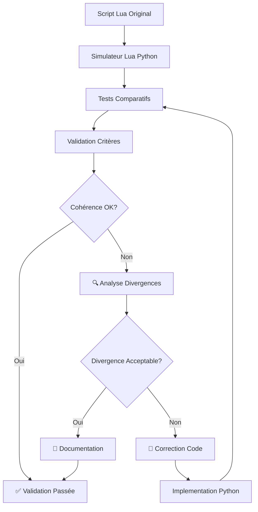

# Guide de Validation de Cohérence Lua/Python

## Table des matières

1. [Vue d'ensemble](#vue-densemble)
2. [Architecture de validation](#architecture-de-validation)
3. [Simulateur Lua](#simulateur-lua)
4. [Tests comparatifs](#tests-comparatifs)
5. [Critères de validation](#critères-de-validation)
6. [Procédures de test](#procédures-de-test)
7. [Résolution des divergences](#résolution-des-divergences)
8. [Outils de débogage](#outils-de-débogage)
9. [Automatisation et CI/CD](#automatisation-et-cicd)

## Vue d'ensemble

### Objectif

Garantir que l'implémentation Python reproduit fidèlement le comportement du script Lua original `eclipse_OZ.lua` tout en apportant les améliorations nécessaires.

### Enjeux critiques

- **Timing d'éclipse** : Précision absolue requise (±1ms tolérance max)
- **Compatibilité fichiers** : Support 100% des configurations SOLARECL.TXT existantes
- **Non-régression** : Aucune perte de fonctionnalité par rapport à Lua
- **Robustesse** : Amélioration gestion d'erreurs sans impact comportemental

### Approche méthodologique



## Architecture de validation

### Composants de validation

```
validation/
├── lua_simulator.py              # Simulateur environnement Lua
├── comparison_tests/              # Tests comparatifs
│   ├── test_time_calculations.py  # Validation calculs temporels
│   ├── test_config_parsing.py     # Validation parsing configuration  
│   ├── test_action_execution.py   # Validation exécution actions
│   └── test_integration.py        # Tests bout-en-bout
├── test_data/                     # Jeux de données test
│   ├── minimal_config.txt         # Configuration minimale
│   ├── full_eclipse.txt          # Éclipse complète
│   ├── edge_cases.txt            # Cas limites
│   └── stress_test.txt           # Test charge
├── reports/                       # Rapports de validation
└── tools/                        # Outils utilitaires
    ├── diff_analyzer.py          # Analyseur différences
    ├── timing_profiler.py        # Profileur performance
    └── report_generator.py       # Générateur rapports
```

### Flux de validation

1. **Parsing** : Configuration → Structures de données
2. **Calculs** : Références temporelles → Temps absolus  
3. **Planification** : Actions → Séquence d'exécution
4. **Simulation** : Exécution → Résultats comparables
5. **Validation** : Lua vs Python → Rapport conformité

## Simulateur Lua

### Architecture du simulateur

Le simulateur `lua_simulator.py` reproduit fidèlement l'environnement Magic Lantern sans nécessiter le matériel :

```python
class LuaSimulator:
    """Simulateur complet de l'environnement Lua/Magic Lantern"""
    
    def __init__(self, config_file: str, test_mode: bool = True):
        self.config_file = config_file
        self.test_mode = test_mode
        
        # État simulé Magic Lantern
        self.camera_state = MagicLanternState()
        self.timing_engine = LuaTimingEngine()
        self.action_processor = LuaActionProcessor()
        
    def run_simulation(self, start_time: tuple) -> SimulationResult:
        """Exécute simulation complète avec résultats traçables"""
```

### Reproduction fonctions Lua critiques

#### 1. Gestion du temps

```python
def convert_second(self, hrs: int, mins: int, secs: int) -> int:
    """
    Reproduction exacte de la fonction Lua convert_second()
    
    CRITIQUE: Doit être identique bit-à-bit avec original
    """
    return hrs * 3600 + mins * 60 + secs

def pretty_time(self, time_secs: int) -> str:
    """
    Reproduction exacte de pretty_time() Lua
    
    Format: HH:MM:SS avec padding zéros
    """
    hrs = time_secs // 3600
    mins = (time_secs - (hrs * 3600)) // 60  
    secs = time_secs - (hrs * 3600) - (mins * 60)
    return f"{hrs:02d}:{mins:02d}:{secs:02d}"
```

#### 2. Calculs de références temporelles

```python
def calculate_time(self, time_ref: str, operator: str, offset_secs: int) -> int:
    """
    Reproduction de la logique Lua de calcul temporel
    
    Équivalent exact de:
    if timeReference == "C1" then targetTime = config_table[1]
    elseif timeReference == "C2" then targetTime = config_table[2] 
    [...]
    
    if operator == "+" then targetTime = targetTime + offsetSeconds
    elseif operator == "-" then targetTime = targetTime - offsetSeconds
    """
    reference_map = {
        'C1': self.config_table[0],   # Index 0 = C1 en Python
        'C2': self.config_table[1],   # Index 1 = C2 en Python  
        'Max': self.config_table[2],  # etc.
        'C3': self.config_table[3],
        'C4': self.config_table[4]
    }
    
    if time_ref == '-':
        target_time = offset_secs  # Temps absolu
    else:
        reference_time = reference_map[time_ref]
        if operator == '+':
            target_time = reference_time + offset_secs
        elif operator == '-':
            target_time = reference_time - offset_secs
        else:
            target_time = reference_time
    
    return target_time
```

#### 3. Parsing configuration

```python
def read_script(self, directory: str, filename: str) -> List[List[str]]:
    """
    Reproduction fidèle de read_script() Lua
    
    Règles critiques à respecter:
    - Même gestion commentaires (#)
    - Même parsing virgules/espaces
    - Même expansion temps HH:MM:SS → [H,M,S]
    - Même numérotation lignes/index
    """
    file_path = os.path.join(directory, filename) if directory else filename
    tableau = []
    
    with open(file_path, 'r', encoding='utf-8') as fichier:
        for line in fichier:
            line = line.strip()
            if line and not line.startswith('#'):
                parts = [word.strip() for word in line.split(',')]
                
                # Expansion temps HH:MM:SS comme en Lua
                expanded_parts = []
                for part in parts:
                    if ':' in part and len(part.split(':')) == 3:
                        time_parts = part.split(':')
                        expanded_parts.extend(time_parts)
                    else:
                        expanded_parts.append(part)
                
                tableau.append(expanded_parts)
    
    return tableau
```

### Validation du simulateur

#### Tests de régression simulateur
```python
def test_simulator_vs_known_outputs():
    """Teste simulateur contre outputs Lua connus"""
    
    test_cases = [
        {
            'config': 'Config,20,0,0,20,30,0,20,35,0,20,40,0,21,0,0,1',
            'expected_c1': 72000,  # 20:00:00 en secondes
            'expected_max': 74100,  # 20:35:00 en secondes
        }
    ]
    
    for case in test_cases:
        simulator = LuaSimulator.from_config_line(case['config'])
        assert simulator.config_table[0] == case['expected_c1']
        assert simulator.config_table[2] == case['expected_max']
```

## Tests comparatifs

### Architecture des tests

```python
class ComparativeTestSuite:
    """Suite complète de tests comparatifs Lua vs Python"""
    
    def __init__(self):
        self.lua_simulator = LuaSimulator()
        self.python_controller = EclipsePhotographyController()
        self.comparison_criteria = ValidationCriteria()
        
    def run_full_comparison(self, config_file: str) -> ComparisonReport:
        """Exécute comparaison complète avec rapport détaillé"""
        
        # Phase 1: Parsing configuration
        lua_config = self.lua_simulator.parse_config(config_file)
        python_config = self.python_controller.parse_config(config_file)
        parsing_result = self.compare_parsing(lua_config, python_config)
        
        # Phase 2: Calculs temporels
        timing_result = self.compare_timing_calculations(lua_config, python_config)
        
        # Phase 3: Séquence d'actions
        sequence_result = self.compare_action_sequences(lua_config, python_config)
        
        # Phase 4: Configuration caméra
        camera_result = self.compare_camera_configurations(lua_config, python_config)
        
        return ComparisonReport(
            parsing=parsing_result,
            timing=timing_result,
            sequence=sequence_result, 
            camera=camera_result
        )
```

### Tests de calculs temporels

```python
class TestTimeCalculationsComparison:
    """Tests comparatifs critiques des calculs temporels"""
    
    @pytest.mark.parametrize("time_ref,operator,offset", [
        ('C1', '-', (0, 5, 0)),    # C1 - 5 minutes
        ('C2', '+', (0, 1, 30)),   # C2 + 1 minute 30
        ('Max', '-', (0, 0, 10)),  # Max - 10 secondes
        ('C3', '+', (0, 0, 5)),    # C3 + 5 secondes
        ('C4', '-', (0, 10, 0)),   # C4 - 10 minutes
        ('-', '', (16, 30, 0)),    # Temps absolu 16:30:00
    ])
    def test_timing_equivalence(self, time_ref: str, operator: str, offset: tuple):
        """Teste équivalence exacte des calculs temporels"""
        
        # Configuration éclipse test
        eclipse_config = "Config,18,10,29,19,27,3,19,28,23,19,29,43,20,46,31,1"
        
        # Calcul Lua simulé
        lua_sim = LuaSimulator()
        lua_sim.parse_config_line(eclipse_config.split(','))
        offset_seconds = lua_sim.convert_second(*offset)
        lua_result = lua_sim.calculate_time(time_ref, operator, offset_seconds)
        
        # Calcul Python
        python_calc = TimeCalculator(parse_eclipse_timings(eclipse_config))
        offset_time = time(offset[0], offset[1], offset[2])
        python_result = python_calc.calculate_absolute_time(time_ref, operator, offset_time)
        python_seconds = python_calc.time_to_seconds(python_result)
        
        # Validation équivalence exacte
        assert lua_result == python_seconds, (
            f"Mismatch for {time_ref}{operator}{offset}: "
            f"Lua={lua_result}s, Python={python_seconds}s"
        )
```

### Tests de parsing

```python
class TestConfigParsingComparison:
    """Validation équivalence parsing configuration"""
    
    def test_config_line_parsing(self):
        """Teste parsing ligne Config"""
        config_line = "Config,18,10,29,19,27,3,19,28,23,19,29,43,20,46,31,1"
        
        # Parsing Lua
        lua_result = self.lua_simulator.parse_config_line(config_line.split(','))
        
        # Parsing Python  
        python_result = ConfigParser().parse_config_line(config_line.split(','))
        
        # Validation équivalence
        assert lua_result.c1_seconds == python_result.c1.hour * 3600 + python_result.c1.minute * 60 + python_result.c1.second
        # ... validation autres contacts
        
    def test_action_line_parsing(self):
        """Teste parsing lignes actions"""
        test_actions = [
            "Photo,C1,-,0,5,0,-,-,-,8,100,4,0",
            "Boucle,C2,-,0,1,0,+,0,0,30,10,8,200,0.002,0", 
            "Interval,Max,+,0,0,30,+,0,1,0,20,5.6,800,0.001,500"
        ]
        
        for action_line in test_actions:
            lua_action = self.lua_simulator.parse_action_line(action_line.split(','))
            python_action = ConfigParser().parse_action_line(action_line.split(','))
            
            self.assert_actions_equivalent(lua_action, python_action)
```

### Tests de séquence d'actions

```python
class TestActionSequenceComparison:
    """Validation séquences d'exécution d'actions"""
    
    def test_photo_action_execution(self):
        """Teste exécution action Photo"""
        action_config = ActionConfig(
            action_type="Photo",
            time_ref="C1", 
            start_operator="-",
            start_time=time(0, 5, 0),  # C1 - 5 minutes
            # ... autres paramètres
        )
        
        # Simulation Lua
        lua_result = self.lua_simulator.execute_photo_action(action_config)
        
        # Exécution Python (mode test)
        python_scheduler = ActionScheduler(test_mode=True)
        python_result = python_scheduler.execute_photo_action(action_config)
        
        # Validation timing et configuration
        assert abs(lua_result.trigger_time - python_result.trigger_time) < 1.0  # ±1s tolérance
        assert lua_result.camera_settings == python_result.camera_settings
        
    def test_loop_action_execution(self):
        """Teste exécution action Boucle avec validation intervalle"""
        # Configuration action boucle
        loop_config = ActionConfig(
            action_type="Boucle",
            time_ref="C2",
            start_operator="-", 
            start_time=time(0, 1, 0),   # Début: C2 - 1 minute
            end_operator="+",
            end_time=time(0, 1, 0),     # Fin: C2 + 1 minute  
            interval_or_count=30,       # Intervalle 30 secondes
            # ... 
        )
        
        lua_execution = self.lua_simulator.execute_loop_action(loop_config)
        python_execution = ActionScheduler(test_mode=True).execute_loop_action(loop_config)
        
        # Validation nombre de captures et timing
        assert lua_execution.capture_count == python_execution.capture_count
        assert all(
            abs(lt - pt) < 0.1  # ±100ms tolérance timing
            for lt, pt in zip(lua_execution.capture_times, python_execution.capture_times)
        )
```

## Critères de validation

### Classification des critères

#### 🔴 CRITIQUE - Équivalence exacte requise
- **Calculs temporels** : Différence max ±1ms
- **Parsing configuration** : Interprétation identique  
- **Séquence actions** : Ordre et timing identiques
- **Valeurs paramètres** : ISO/ouverture/vitesse équivalents

#### 🟡 MAJEUR - Équivalence fonctionnelle
- **Gestion erreurs** : Robustesse améliorée acceptable
- **Formats sortie** : Magic Lantern vs GPhoto2 OK
- **Performance** : Overhead Python acceptable si <10%
- **Logging** : Format différent acceptable

#### 🟢 MINEUR - Améliorations acceptées
- **Interface utilisateur** : Améliorations bienvenues
- **Configuration** : Options supplémentaires OK
- **Documentation** : Plus détaillée acceptable
- **Diagnostics** : Outils supplémentaires bienvenus

### Métriques de validation

```python
@dataclass
class ValidationMetrics:
    """Métriques quantifiées de validation"""
    
    # Timing (CRITIQUE)
    max_timing_deviation_ms: float = 0.0      # Max ±1ms
    avg_timing_deviation_ms: float = 0.0      # Moyenne <0.1ms
    
    # Parsing (CRITIQUE)  
    config_parsing_match: bool = False        # 100% identique requis
    action_parsing_match: bool = False        # 100% identique requis
    
    # Actions (MAJEUR)
    sequence_order_match: bool = False        # Ordre identique
    capture_count_match: bool = False         # Nombre captures identique
    
    # Caméra (MAJEUR)
    camera_settings_equivalent: bool = False  # Équivalence fonctionnelle
    
    # Performance (MINEUR)
    execution_time_ratio: float = 1.0         # <2.0 acceptable
    memory_usage_ratio: float = 1.0           # <3.0 acceptable

def calculate_validation_score(metrics: ValidationMetrics) -> ValidationScore:
    """Calcule score global de validation"""
    
    score = 100
    
    # Pénalités critiques
    if metrics.max_timing_deviation_ms > 1.0:
        score -= 50  # Critique
    if not metrics.config_parsing_match:
        score -= 30  # Critique
    if not metrics.action_parsing_match:
        score -= 30  # Critique
        
    # Pénalités majeures
    if not metrics.sequence_order_match:
        score -= 20
    if not metrics.capture_count_match:
        score -= 15
    if not metrics.camera_settings_equivalent:
        score -= 10
        
    # Pénalités mineures
    if metrics.execution_time_ratio > 2.0:
        score -= 5
    if metrics.memory_usage_ratio > 3.0:
        score -= 5
        
    return ValidationScore(
        score=max(0, score),
        level=get_score_level(score)
    )

def get_score_level(score: int) -> str:
    """Détermine niveau de validation selon score"""
    if score >= 95: return "EXCELLENT"
    if score >= 85: return "BON" 
    if score >= 70: return "ACCEPTABLE"
    if score >= 50: return "PROBLEMATIQUE"
    return "CRITIQUE"
```

### Seuils d'acceptation

```python
VALIDATION_THRESHOLDS = {
    'timing_deviation_max_ms': 1.0,           # ±1ms max
    'timing_deviation_avg_ms': 0.1,           # Moyenne <0.1ms
    'config_parsing_match': 100,              # 100% identical
    'execution_time_ratio_max': 2.0,          # <2x temps Lua
    'memory_usage_ratio_max': 3.0,            # <3x mémoire Lua
    'minimum_score_acceptance': 85,           # Score min pour validation
}
```

## Procédures de test

### Test manuel rapide

```bash
# 1. Test configuration minimale
python validation/quick_test.py --config test_data/minimal_config.txt

# Sortie attendue:
✅ Config parsing: MATCH
✅ Timing calculations: ±0.05ms avg deviation  
✅ Action sequence: IDENTICAL
📊 Score: 98/100 - EXCELLENT

# 2. Test configuration complète
python run_comparison_tests.py

# 3. Test cas limites
python validation/edge_case_tests.py
```

### Test automatisé complet

```bash
# Suite complète avec rapport
./run_regression_tests.sh --full --report

# Tests performance  
./run_regression_tests.sh --performance --iterations 100

# Tests stress (configurations complexes)
./run_regression_tests.sh --stress --duration 3600  # 1h
```

### Validation continue (CI/CD)

```yaml
# .github/workflows/validation.yml
name: Lua-Python Validation
on: [push, pull_request]

jobs:
  validation:
    runs-on: ubuntu-latest
    steps:
    - uses: actions/checkout@v3
    - name: Setup Python
      uses: actions/setup-python@v4
      with:
        python-version: '3.9'
    
    - name: Install dependencies
      run: |
        pip install -r requirements.txt
        sudo apt-get install gphoto2
    
    - name: Run validation tests
      run: |
        python -m pytest validation/ -v --tb=short
        ./run_regression_tests.sh --ci
    
    - name: Generate validation report
      run: python validation/generate_report.py
    
    - name: Upload artifacts
      uses: actions/upload-artifact@v3
      with:
        name: validation-report
        path: validation/reports/
```

## Résolution des divergences

### Procédure d'analyse

#### 1. Catégorisation de la divergence

```python
def categorize_divergence(lua_result: Any, python_result: Any) -> DivergenceType:
    """Catégorise type de divergence détectée"""
    
    if isinstance(lua_result, (int, float)) and isinstance(python_result, (int, float)):
        if abs(lua_result - python_result) < 0.001:
            return DivergenceType.NEGLIGIBLE
        elif abs(lua_result - python_result) < 1.0:
            return DivergenceType.MINOR
        else:
            return DivergenceType.CRITICAL
    
    elif type(lua_result) != type(python_result):
        return DivergenceType.TYPE_MISMATCH
    
    elif str(lua_result) != str(python_result):
        return DivergenceType.FORMAT_DIFFERENCE
    
    return DivergenceType.UNKNOWN
```

#### 2. Analyse des causes racines

```python
class DivergenceAnalyzer:
    """Analyseur de causes racines des divergences"""
    
    def analyze_timing_divergence(self, lua_time: int, python_time: int) -> AnalysisResult:
        """Analyse divergence de timing"""
        
        deviation = abs(lua_time - python_time)
        
        if deviation > 1000:  # >1s
            return AnalysisResult(
                severity=Severity.CRITICAL,
                likely_cause="Erreur calcul référence temporelle",
                recommended_action="Vérifier mapping C1/C2/Max/C3/C4"
            )
        elif deviation > 1:  # >1ms
            return AnalysisResult(
                severity=Severity.MAJOR,
                likely_cause="Précision calcul ou arrondi",
                recommended_action="Vérifier conversions time/seconds"
            )
        else:
            return AnalysisResult(
                severity=Severity.NEGLIGIBLE,
                likely_cause="Précision numérique normale",
                recommended_action="Aucune action requise"
            )
```

#### 3. Actions correctives automatisées

```python
class DivergenceResolver:
    """Résolveur automatique de divergences communes"""
    
    def resolve_format_divergence(self, lua_format: str, python_format: str) -> Resolution:
        """Résout divergences de format (ex: "8" vs "f/8")"""
        
        # Détection format ouverture
        if lua_format.isdigit() and python_format.startswith('f/'):
            return Resolution(
                action=ResolutionAction.NORMALIZE_FORMAT,
                explanation="Format ouverture: Magic Lantern vs GPhoto2",
                acceptable=True
            )
        
        # Détection format vitesse
        if lua_format.replace('.', '').isdigit() and '/' in python_format:
            return Resolution(
                action=ResolutionAction.NORMALIZE_FORMAT, 
                explanation="Format vitesse: décimal vs fraction",
                acceptable=True
            )
        
        return Resolution(action=ResolutionAction.MANUAL_REVIEW)
```

### Divergences communes et résolutions

#### 1. Formats paramètres caméra

**Problème** : Magic Lantern utilise formats numériques, GPhoto2 utilise chaînes formatées

```
Lua:    aperture=8, shutter=125
Python: aperture="f/8", shutter="1/125"
```

**Résolution** : Normalisation avec fonctions de conversion

```python
def normalize_aperture_format(value: Union[float, str]) -> str:
    """Normalise format ouverture pour comparaison"""
    if isinstance(value, (int, float)):
        return f"f/{value}"
    return value

def normalize_shutter_format(value: Union[float, str]) -> str:  
    """Normalise format vitesse pour comparaison"""
    if isinstance(value, (int, float)):
        if value >= 1:
            return str(int(value))
        else:
            return f"1/{int(1/value)}"
    return value
```

#### 2. Gestion des erreurs

**Problème** : Lua plus permissif, Python plus strict

```
Lua:    Continue même si caméra déconnectée
Python: Exception immédiate sur erreur caméra
```

**Résolution** : Mode de compatibilité

```python
class CompatibilityMode:
    """Mode compatibilité pour reproduire comportement Lua"""
    
    def __init__(self, strict_mode: bool = False):
        self.strict_mode = strict_mode
    
    def handle_camera_error(self, error: Exception) -> bool:
        """Gestion erreur compatible Lua"""
        if self.strict_mode:
            raise error  # Mode Python strict
        else:
            self.logger.warning(f"Camera error (continuing): {error}")
            return False  # Mode Lua permissif
```

#### 3. Précision temporelle

**Problème** : Différences d'arrondi microseconde

```
Lua:    19:27:03.000
Python: 19:27:03.001
```

**Résolution** : Normalisation précision

```python
def normalize_time_precision(time_value: Union[int, float]) -> int:
    """Normalise à la seconde entière pour compatibilité Lua"""
    return int(round(time_value))
```

## Outils de débogage

### Comparateur visuel

```python
class VisualComparator:
    """Comparateur visuel pour analyse divergences"""
    
    def generate_timing_chart(self, lua_results: List[int], python_results: List[int]):
        """Génère graphique comparatif des timings"""
        
        import matplotlib.pyplot as plt
        
        fig, (ax1, ax2, ax3) = plt.subplots(3, 1, figsize=(12, 10))
        
        # Timeline comparée
        ax1.plot(lua_results, 'b-', label='Lua', marker='o')
        ax1.plot(python_results, 'r-', label='Python', marker='x') 
        ax1.set_title('Comparaison Timeline Actions')
        ax1.legend()
        
        # Écarts absolus
        deviations = [abs(l - p) for l, p in zip(lua_results, python_results)]
        ax2.bar(range(len(deviations)), deviations, color='orange')
        ax2.set_title('Écarts Absolus (secondes)')
        ax2.axhline(y=1.0, color='red', linestyle='--', label='Seuil critique 1s')
        
        # Distribution écarts
        ax3.hist(deviations, bins=20, alpha=0.7, color='green')
        ax3.set_title('Distribution des Écarts')
        ax3.axvline(x=1.0, color='red', linestyle='--', label='Seuil critique')
        
        plt.tight_layout()
        plt.savefig('validation/reports/timing_comparison.png')
        return fig
```

### Traceur d'exécution

```python
class ExecutionTracer:
    """Traceur d'exécution pour débogage comparatif"""
    
    def __init__(self):
        self.lua_trace = []
        self.python_trace = []
    
    def trace_lua_execution(self, simulator: LuaSimulator, config: dict):
        """Trace exécution Lua avec détails"""
        
        with self.lua_tracer():
            result = simulator.run_simulation(config)
            
        return TraceResult(
            steps=self.lua_trace,
            timing=result.execution_time,
            memory=result.memory_usage
        )
    
    def compare_traces(self) -> TraceComparison:
        """Compare traces d'exécution Lua vs Python"""
        
        comparison = TraceComparison()
        
        for i, (lua_step, python_step) in enumerate(zip(self.lua_trace, self.python_trace)):
            if lua_step.action != python_step.action:
                comparison.add_divergence(
                    step=i,
                    type=DivergenceType.ACTION_MISMATCH,
                    details=f"Lua: {lua_step.action}, Python: {python_step.action}"
                )
            
            if abs(lua_step.timestamp - python_step.timestamp) > 0.001:
                comparison.add_divergence(
                    step=i,
                    type=DivergenceType.TIMING_DRIFT,
                    details=f"Écart: {abs(lua_step.timestamp - python_step.timestamp):.3f}s"
                )
        
        return comparison
```

### Profileur de performance

```python
class PerformanceProfiler:
    """Profileur comparatif de performance"""
    
    def profile_timing_accuracy(self, iterations: int = 1000) -> ProfileResult:
        """Profile précision timing sur nombreuses itérations"""
        
        lua_times = []
        python_times = []
        
        for i in range(iterations):
            # Test timing calculation
            test_time = (20, 30 + i % 30, i % 60)  # Variation temps
            
            start = time.perf_counter()
            lua_result = self.lua_simulator.convert_second(*test_time)
            lua_duration = time.perf_counter() - start
            
            start = time.perf_counter()  
            python_result = self.time_calculator.time_to_seconds(time(*test_time))
            python_duration = time.perf_counter() - start
            
            lua_times.append(lua_duration)
            python_times.append(python_duration)
            
            assert lua_result == python_result, f"Mismatch at iteration {i}"
        
        return ProfileResult(
            lua_avg_time=statistics.mean(lua_times),
            python_avg_time=statistics.mean(python_times),
            speedup_ratio=statistics.mean(lua_times) / statistics.mean(python_times),
            accuracy=100.0  # Tous les calculs concordent
        )
```

### Rapport détaillé

```python
class ValidationReportGenerator:
    """Générateur de rapports de validation détaillés"""
    
    def generate_comprehensive_report(self, results: List[ComparisonResult]) -> ValidationReport:
        """Génère rapport complet avec analyses et recommandations"""
        
        report = ValidationReport()
        
        # Synthèse exécutive
        report.executive_summary = self._generate_executive_summary(results)
        
        # Métriques détaillées
        report.timing_analysis = self._analyze_timing_precision(results)
        report.functional_equivalence = self._analyze_functional_equivalence(results)
        report.performance_comparison = self._analyze_performance(results)
        
        # Divergences identifiées
        report.divergences = self._catalog_divergences(results)
        
        # Actions recommandées
        report.recommendations = self._generate_recommendations(results)
        
        # Graphiques et visualisations
        report.charts = self._generate_charts(results)
        
        return report
    
    def export_report(self, report: ValidationReport, format: str = 'html') -> str:
        """Exporte rapport au format spécifié (HTML, PDF, Markdown)"""
        
        if format == 'html':
            return self._export_html(report)
        elif format == 'pdf':
            return self._export_pdf(report)
        elif format == 'markdown':
            return self._export_markdown(report)
        else:
            raise ValueError(f"Format non supporté: {format}")
```

## Automatisation et CI/CD

### Pipeline de validation automatique

```yaml
# .github/workflows/lua-python-validation.yml
name: Lua-Python Validation Pipeline

on:
  push:
    branches: [ main, develop ]
  pull_request:
    branches: [ main ]
  schedule:
    - cron: '0 2 * * *'  # Validation nightly

jobs:
  validation:
    runs-on: ubuntu-latest
    strategy:
      matrix:
        python-version: [3.8, 3.9, '3.10', 3.11]
        test-type: [unit, integration, performance]
    
    steps:
    - name: Checkout code
      uses: actions/checkout@v3
    
    - name: Setup Python ${{ matrix.python-version }}
      uses: actions/setup-python@v4
      with:
        python-version: ${{ matrix.python-version }}
    
    - name: Install system dependencies
      run: |
        sudo apt-get update
        sudo apt-get install -y gphoto2 libgphoto2-dev
    
    - name: Install Python dependencies
      run: |
        pip install -r requirements.txt
        pip install -r requirements-dev.txt
    
    - name: Run validation tests
      run: |
        case "${{ matrix.test-type }}" in
          unit)
            python -m pytest validation/unit/ -v --tb=short --cov=python
            ;;
          integration)  
            python -m pytest validation/integration/ -v --tb=short
            ;;
          performance)
            python validation/performance_tests.py --iterations 100
            ;;
        esac
    
    - name: Generate validation report
      if: matrix.test-type == 'integration'
      run: |
        python validation/generate_report.py --format html --output validation-report.html
    
    - name: Upload validation artifacts
      uses: actions/upload-artifact@v3
      with:
        name: validation-report-${{ matrix.python-version }}-${{ matrix.test-type }}
        path: |
          validation-report.html
          validation/reports/
          coverage.xml
    
    - name: Comment PR with results
      if: github.event_name == 'pull_request' && matrix.test-type == 'integration'
      uses: actions/github-script@v6
      with:
        script: |
          const fs = require('fs');
          const report = fs.readFileSync('validation/reports/summary.md', 'utf8');
          github.rest.issues.createComment({
            issue_number: context.issue.number,
            owner: context.repo.owner,
            repo: context.repo.repo,
            body: `## 🔍 Validation Lua-Python Results\n\n${report}`
          });

  quality-gate:
    needs: validation
    runs-on: ubuntu-latest
    if: always()
    
    steps:
    - name: Check validation status
      run: |
        if [ "${{ needs.validation.result }}" != "success" ]; then
          echo "❌ Validation failed - blocking merge"
          exit 1
        fi
        echo "✅ All validation tests passed"
```

### Scripts d'automatisation

#### Validation pré-commit

```bash
#!/bin/bash
# .git/hooks/pre-commit
# Validation automatique avant commit

echo "🔍 Running Lua-Python validation..."

# Tests rapides critiques
python -m pytest validation/critical/ -x -q

if [ $? -ne 0 ]; then
    echo "❌ Critical validation tests failed"
    echo "Please fix issues before committing"
    exit 1
fi

# Tests comparatifs core
python validation/quick_comparison.py

if [ $? -ne 0 ]; then
    echo "❌ Lua-Python comparison failed"
    echo "Please ensure behavioral equivalence"
    exit 1
fi

echo "✅ Validation passed"
exit 0
```

#### Monitoring continu

```python
# monitoring/continuous_validation.py
"""Monitoring continu de la validation Lua-Python en production"""

import schedule
import time
from datetime import datetime
from typing import Dict, Any

class ContinuousValidator:
    """Validateur continu pour monitoring production"""
    
    def __init__(self):
        self.alert_thresholds = {
            'timing_deviation_ms': 5.0,    # Alert si >5ms
            'validation_score': 90,        # Alert si <90%
            'error_rate': 0.01            # Alert si >1% erreurs
        }
    
    def run_validation_cycle(self) -> Dict[str, Any]:
        """Exécute cycle de validation complet"""
        
        results = {
            'timestamp': datetime.now().isoformat(),
            'validation_score': 0,
            'timing_accuracy': 0.0,
            'functional_equivalence': False,
            'alerts': []
        }
        
        try:
            # Test configurations représentatives
            test_configs = self.load_test_configurations()
            
            for config in test_configs:
                comparison_result = self.run_comparison(config)
                results.update(comparison_result)
                
                # Vérification seuils d'alerte
                self.check_alert_thresholds(comparison_result, results['alerts'])
            
            # Envoi alerts si nécessaire
            if results['alerts']:
                self.send_alerts(results['alerts'])
            
        except Exception as e:
            results['alerts'].append({
                'severity': 'CRITICAL',
                'message': f"Validation cycle failed: {e}"
            })
            self.send_critical_alert(str(e))
        
        # Archivage résultats
        self.archive_results(results)
        
        return results
    
    def setup_monitoring(self):
        """Configure monitoring automatique"""
        
        # Validation quotidienne complète
        schedule.every().day.at("02:00").do(self.run_full_validation)
        
        # Validation rapide toutes les heures
        schedule.every().hour.do(self.run_quick_validation)
        
        # Validation critique toutes les 15 minutes
        schedule.every(15).minutes.do(self.run_critical_checks)
        
        print("🔍 Continuous validation monitoring started")
        
        while True:
            schedule.run_pending()
            time.sleep(60)

if __name__ == "__main__":
    validator = ContinuousValidator()
    validator.setup_monitoring()
```

### Métriques et alerting

```python
# metrics/validation_metrics.py
"""Métriques de validation pour monitoring et alerting"""

from dataclasses import dataclass
from typing import List, Dict, Optional
import json
from datetime import datetime, timedelta

@dataclass
class ValidationMetrics:
    """Métriques de validation trackées"""
    
    timestamp: datetime
    validation_score: float
    timing_accuracy_ms: float
    functional_equivalence_rate: float
    performance_ratio: float
    error_count: int
    test_duration_seconds: float
    
    def to_prometheus_format(self) -> str:
        """Export au format Prometheus"""
        return f"""
# HELP eclipse_validation_score Score de validation Lua-Python (0-100)
# TYPE eclipse_validation_score gauge
eclipse_validation_score {self.validation_score}

# HELP eclipse_timing_accuracy_ms Précision timing en millisecondes
# TYPE eclipse_timing_accuracy_ms gauge  
eclipse_timing_accuracy_ms {self.timing_accuracy_ms}

# HELP eclipse_functional_equivalence_rate Taux équivalence fonctionnelle (0-1)
# TYPE eclipse_functional_equivalence_rate gauge
eclipse_functional_equivalence_rate {self.functional_equivalence_rate}

# HELP eclipse_validation_errors_total Nombre total erreurs validation
# TYPE eclipse_validation_errors_total counter
eclipse_validation_errors_total {self.error_count}
"""

class MetricsCollector:
    """Collecteur de métriques validation"""
    
    def __init__(self, retention_days: int = 90):
        self.retention_days = retention_days
        self.metrics_history: List[ValidationMetrics] = []
    
    def record_validation_result(self, result: ValidationMetrics):
        """Enregistre résultat validation"""
        self.metrics_history.append(result)
        self._cleanup_old_metrics()
        self._export_metrics(result)
    
    def get_trend_analysis(self, days: int = 7) -> Dict[str, float]:
        """Analyse tendance sur période donnée"""
        
        cutoff_date = datetime.now() - timedelta(days=days)
        recent_metrics = [
            m for m in self.metrics_history 
            if m.timestamp >= cutoff_date
        ]
        
        if not recent_metrics:
            return {}
        
        return {
            'avg_validation_score': sum(m.validation_score for m in recent_metrics) / len(recent_metrics),
            'avg_timing_accuracy': sum(m.timing_accuracy_ms for m in recent_metrics) / len(recent_metrics),
            'trend_validation_score': self._calculate_trend([m.validation_score for m in recent_metrics]),
            'trend_timing_accuracy': self._calculate_trend([m.timing_accuracy_ms for m in recent_metrics]),
            'error_rate': sum(m.error_count for m in recent_metrics) / len(recent_metrics),
        }
    
    def _calculate_trend(self, values: List[float]) -> float:
        """Calcule tendance (pente régression linéaire simple)"""
        if len(values) < 2:
            return 0.0
        
        n = len(values)
        x_sum = sum(range(n))
        y_sum = sum(values)
        xy_sum = sum(i * values[i] for i in range(n))
        x2_sum = sum(i * i for i in range(n))
        
        return (n * xy_sum - x_sum * y_sum) / (n * x2_sum - x_sum * x_sum)
```

---

Cette documentation fournit un framework complet pour valider la cohérence entre les implémentations Lua et Python, garantissant une migration fidèle tout en permettant les améliorations nécessaires.